    # Opdracht: Score Opslag en Weergave

## Korte omschrijving
In deze opdracht heb ik een systeem gebouwd waarin de score van de speler wordt bijgehouden en weergegeven tijdens het spel. De score wordt live geüpdatet op basis van het gedrag van de speler (bijvoorbeeld het verzamelen van objecten of behalen van doelen).

## Demonstratie

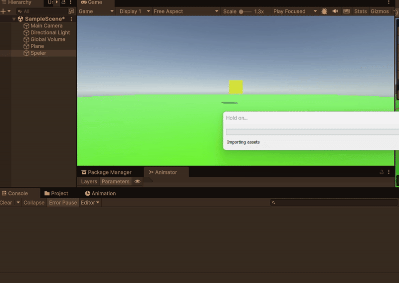

## Betrokken code

- [PlayerScore.cs](https://github.com/zmbfiedk/Prog1-4/blob/main/Assets/Assets/Scripts/PlayerScore.cs)  

# Opdracht: Bewegende Speler

## Korte omschrijving
In deze opdracht heb ik een Unity-scène gemaakt waarin een speler (cube) kan bewegen met de pijltjestoetsen en springen met de spatiebalk. Hiervoor heb ik gebruik gemaakt van een Rigidbody-component en een script om input te verwerken. De beweging en sprong zijn zichtbaar getest met behulp van een gif. Ook heb ik `moveSpeed` en `jumpForce` als public variabelen toegevoegd en een debugbericht laten tonen bij het springen.

## Demonstratie

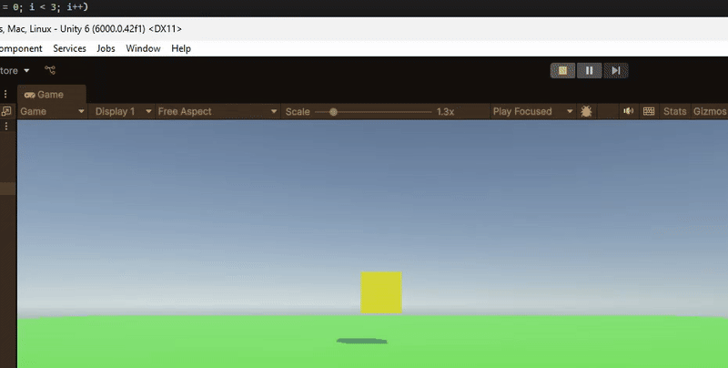

## Betrokken code

- [PlayerControls.cs (les 2)](https://github.com/zmbfiedk/Prog1-4/blob/main/Assets/Assets/Scripts/PlayerControls.cs)

---

# Les 3: Game Logica en Managers

## Demonstratie

## Betrokken code

- [PlayerControls.cs (les 3)](https://github.com/zmbfiedk/Prog1-4/blob/main/Assets/Assets/Scripts/PlayerControls.cs)
- [Gamemanager.cs](https://github.com/zmbfiedk/Prog1-4/blob/main/Assets/Assets/Scripts/Gamemanager.cs)

---

# Les 4: Scene Management en Speler Interactie

## Demonstratie

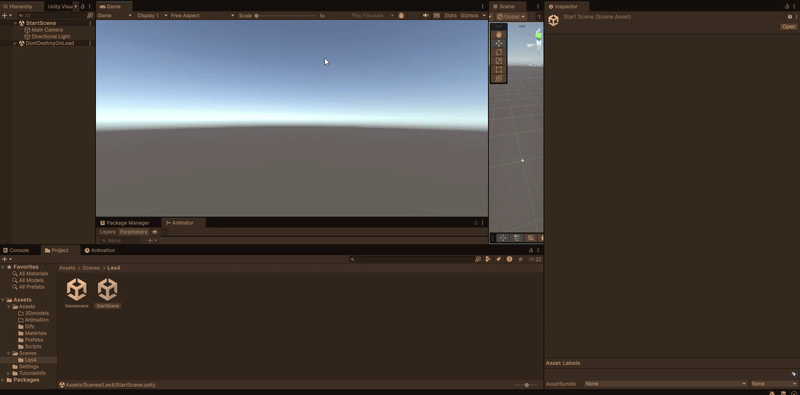

## Betrokken code

- [Playercontrolles4.cs](https://github.com/zmbfiedk/Prog1-4/blob/main/Assets/Assets/Scripts/Playercontrolles4.cs)
- [Scenemanagement.cs](https://github.com/zmbfiedk/Prog1-4/blob/main/Assets/Assets/Scripts/Scenemanagement.cs)

---

# Les 5: Score Opslag en Weergave

## Demonstratie

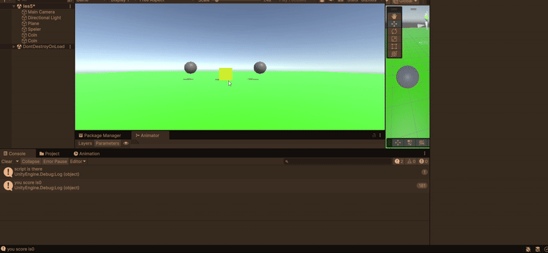

## Betrokken code

- [PlayerMove.cs](https://github.com/zmbfiedk/Prog1-4/blob/main/Assets/Assets/Scripts/PlayerMove.cs)
- [Scoremanager.cs](https://github.com/zmbfiedk/Prog1-4/blob/main/Assets/Assets/Scripts/Scoremanager.cs)

# Les 6: Vector3 Verdieping – "Volger" & Homing Missiles

## Omschrijving van de opdracht

In deze opdracht heb ik gewerkt met `Vector3`-methodes zoals `Lerp`, `Distance`, `magnitude` en `normalized` om een object (de volger) een speler te laten volgen en daarna terug te keren naar zijn startpositie. De speler beweegt met de pijltjestoetsen over de X- en Z-as. Als de volger de speler heeft bereikt, keert deze met een constante snelheid terug.

Daarnaast is de opdracht uitgebreid met een dummy-object dat heen en weer beweegt. De speler kan homing missiles afvuren die automatisch naar de dummy vliegen.

## Demonstratie

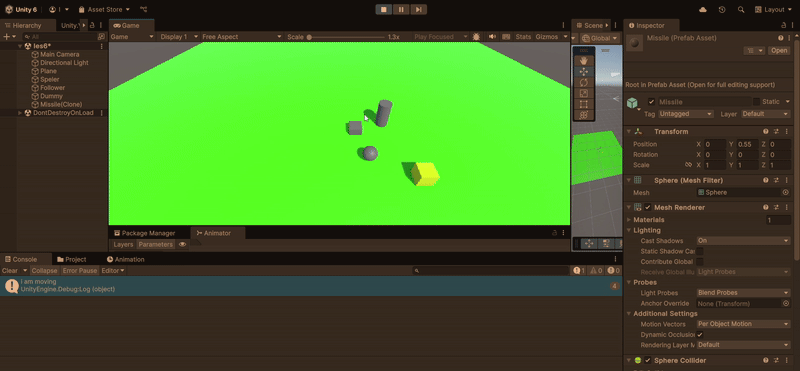

## Betrokken scripts

- [Moveles6.cs (Spelerbeweging)](https://github.com/zmbfiedk/Prog1-4/blob/main/Assets/Assets/Scripts/Les6/Moveles6.cs)
- [FollowAndReturn.cs (Volger logica)](https://github.com/zmbfiedk/Prog1-4/blob/main/Assets/Assets/Scripts/Les6/Follow%20and%20return.cs)
- [Dummy.cs (Bewegende dummy)](https://github.com/zmbfiedk/Prog1-4/blob/main/Assets/Assets/Scripts/Les6/Dummy%20script.cs)
- [Shooting.cs (Afvuren van kogels)](https://github.com/zmbfiedk/Prog1-4/blob/main/Assets/Assets/Scripts/Les6/Shooting.cs)
- [HoamingMissel.cs (Homing missile logica)](https://github.com/zmbfiedk/Prog1-4/blob/main/Assets/Assets/Scripts/Les6/Hoaming%20missel.cs)

# Les 7: UI met TextMeshPro – "Muntenscore met TMP"

## Omschrijving van de opdracht

In deze opdracht heb ik een Unity-scène gemaakt waarin een speler munten kan verzamelen. Elke keer als de speler een munt oppakt, wordt de score verhoogd en direct weergegeven in de UI met behulp van **TextMeshPro**. De score wordt bijgehouden via een `ScoreManager`, en de munt verdwijnt bij contact met de speler.

De opdracht is uitgebreid zodat het mogelijk is om per munt in te stellen hoeveel punten deze oplevert via de Unity Inspector.

## Demonstratie

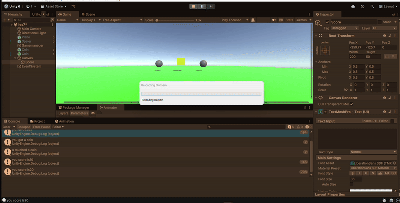

## Betrokken scripts

- [PlayerMove.cs (Spelerbeweging)](https://github.com/zmbfiedk/Prog1-4/blob/main/Assets/Assets/Scripts/PlayerMove.cs)
- [Scoremanager.cs (Scorebeheer)](https://github.com/zmbfiedk/Prog1-4/blob/main/Assets/Assets/Scripts/Scoremanager.cs)
- [Scoreboard.cs (UI TextMeshPro update)](https://github.com/zmbfiedk/Prog1-4/blob/main/Assets/Assets/Scripts/Scoreboard.cs)

# Les 8: Coroutines – "Vijandgolf"

## Omschrijving van de opdracht

In deze opdracht heb ik geleerd hoe ik Coroutines in Unity kan gebruiken om tijdgebaseerde acties uit te voeren. Ik heb een vijandspawnsysteem gemaakt waarbij vijanden in golven verschijnen met een vertraging van 2 seconden tussen elke spawn. Dit werd gedaan met behulp van `StartCoroutine()` en `yield return new WaitForSeconds()`.

Daarnaast heb ik de opdracht uitgebreid met een tweede golf die 5 seconden na de eerste golf verschijnt, en recht achter de eerste rij wordt gespawned.

## Demonstratie

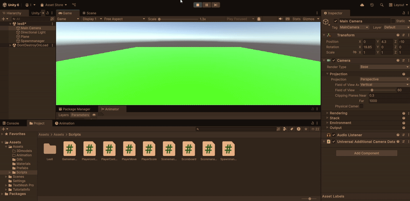

## Betrokken scripts

- [Spawnmanager.cs (Coroutine-gebaseerd spawnsysteem)](https://github.com/zmbfiedk/Prog1-4/blob/main/Assets/Assets/Scripts/Spawnmanager.cs)

# Opdracht 1: Power-Up Systeem – "Tijdelijke Snelheid Boost"

## Korte omschrijving  
In deze opdracht heb ik een **power-up systeem** gemaakt waarbij de speler tijdelijk sneller kan bewegen na het oppakken van een object. Het effect duurt 5 seconden en wordt daarna automatisch weer uitgeschakeld. Hiervoor heb ik gebruikgemaakt van **tags**, **OnTriggerEnter**, **variabelen aanpassen**, en **coroutines**.

## Demonstratie  
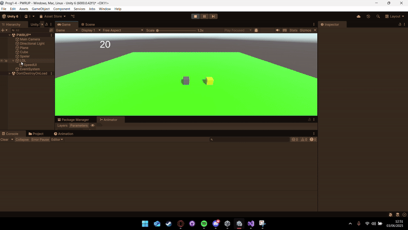

## Betrokken scripts  
- [MoveScript.cs](https://github.com/zmbfiedk/Prog1-4/blob/main/Assets/Assets/Scripts/Les6/Moveles6.cs)  
- [SpeedUiScript.cs](https://github.com/zmbfiedk/Prog1-4/blob/main/Assets/Assets/Scripts/Les6/UI%20script.cs)  

---

# Opdracht 2: AI Patrol System – "Vijand Patrouilleert tussen Waypoints"

## Korte omschrijving  
In deze opdracht heb ik een AI-systeem gebouwd waarbij een vijand automatisch beweegt tussen meerdere waypoints. Als het doelpunt bereikt is, kiest de vijand het volgende punt. De beweging herhaalt zich continu.

## Demonstratie  
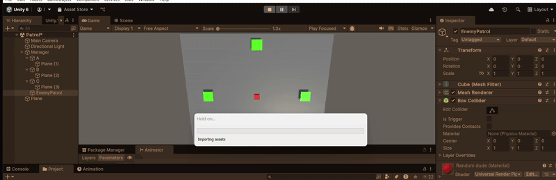

## Betrokken script  
- [EnemyPatrol.cs (commit)](https://github.com/zmbfiedk/Prog1-4/commit/1c6d158d5716b853f25057475758475246a7efcc#diff-4e300f2a70330e747c1cfbe199ce3e1671997b4bc8c0f5cf9c1acea8387ad72f)

---

# Opdracht 3: Countdown Timer + Game Over – "Tijd op = Scene Wissel"

## Korte omschrijving  
In deze opdracht heb ik een aftellende timer gemaakt die zichtbaar is op het scherm met behulp van **TextMeshPro**. Als de tijd op is, wordt automatisch een "Game Over"-scène geladen. Dit is gedaan met `Time.deltaTime`, een if-statement en `SceneManager.LoadScene`.

## Demonstratie  
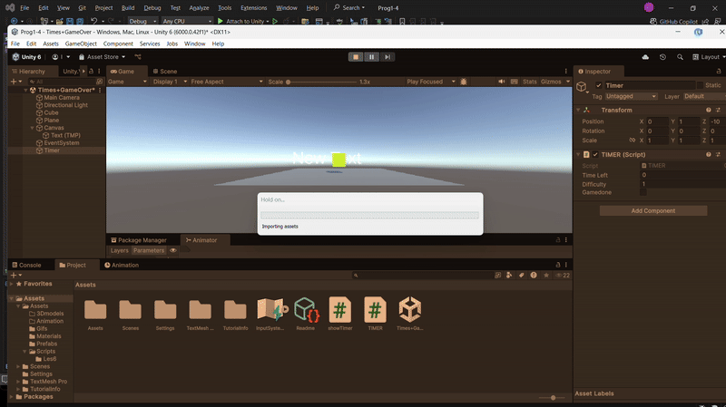

## Betrokken scripts  
- [TIMER.cs](https://github.com/zmbfiedk/Prog1-4/blob/cb84e40a7f9a26a70ee908394a39feec62f0eae1/Assets/TIMER.cs)  
- [showTimer.cs](https://github.com/zmbfiedk/Prog1-4/blob/cb84e40a7f9a26a70ee908394a39feec62f0eae1/Assets/showTimer.cs)

---

# Opdracht 4: Besturingsmodi Wisselen – "Lopen en Rijden"

## Korte omschrijving  
In deze opdracht kan de speler wisselen tussen twee besturingsmodi: lopen en rijden. Afhankelijk van de modus worden andere snelheden en bewegingen gebruikt. De speler kan met één toets wisselen van modus. De status wordt bijgehouden via een `bool`.

## Demonstratie  
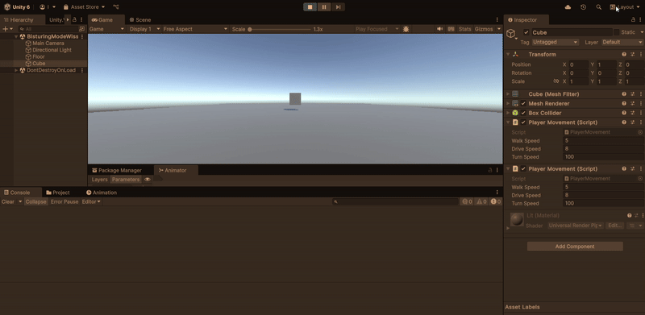

## Betrokken script  
- [PlayerMovement.cs](https://github.com/zmbfiedk/Prog1-4/blob/2dd17c826b6272ca7bf998cc21e493013ffb2001/Assets/Assets/Scripts/PlayerMovement.cs)

---

# Opdracht 5: Inventaris Systeem – "Voorwerpen Verzamelen met Dictionary"

## Korte omschrijving  
In deze opdracht heb ik een inventaris gemaakt waarin meerdere soorten voorwerpen bijgehouden worden. Per soort wordt het aantal geteld met behulp van een **Dictionary**. De speler kan meerdere items tegelijk verzamelen, en de UI wordt automatisch bijgewerkt via TextMeshPro.

## Demonstratie  
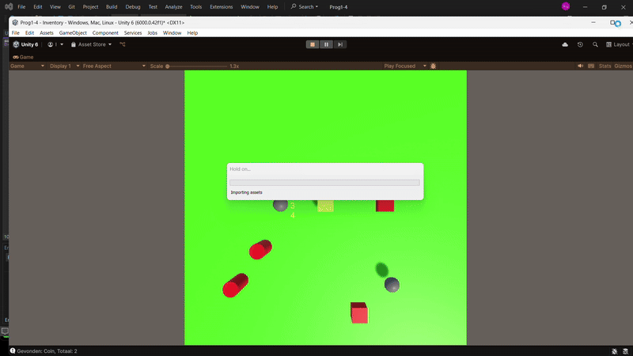

## Betrokken scripts  
- [UIManager.cs](https://github.com/zmbfiedk/Prog1-4/blob/7a1a99aecd8bda46be0b81287d69388e19514ca5/Assets/Assets/Scripts/Inventory/UIManager.cs)  
- [InventoryManager.cs](https://github.com/zmbfiedk/Prog1-4/blob/7a1a99aecd8bda46be0b81287d69388e19514ca5/Assets/Assets/Scripts/Inventory/InventoryManager.cs)  
- [Collectible.cs](https://github.com/zmbfiedk/Prog1-4/blob/7a1a99aecd8bda46be0b81287d69388e19514ca5/Assets/Assets/Scripts/Inventory/Collectible.cs)
