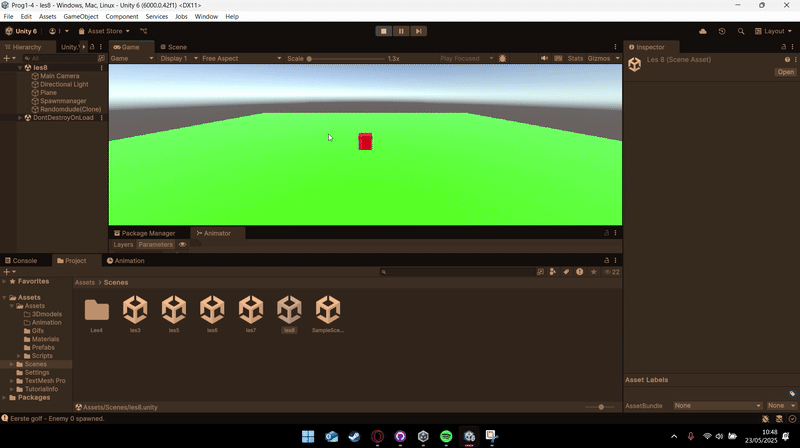

    # Opdracht: Score Opslag en Weergave

## Korte omschrijving
In deze opdracht heb ik een systeem gebouwd waarin de score van de speler wordt bijgehouden en weergegeven tijdens het spel. De score wordt live geüpdatet op basis van het gedrag van de speler (bijvoorbeeld het verzamelen van objecten of behalen van doelen).

## Demonstratie

## Betrokken code

- [PlayerScore.cs](https://github.com/zmbfiedk/Prog1-4/blob/main/Assets/Assets/Scripts/PlayerScore.cs)  

# Opdracht: Bewegende Speler

## Korte omschrijving
In deze opdracht heb ik een Unity-scène gemaakt waarin een speler (cube) kan bewegen met de pijltjestoetsen en springen met de spatiebalk. Hiervoor heb ik gebruik gemaakt van een Rigidbody-component en een script om input te verwerken. De beweging en sprong zijn zichtbaar getest met behulp van een gif. Ook heb ik `moveSpeed` en `jumpForce` als public variabelen toegevoegd en een debugbericht laten tonen bij het springen.

## Demonstratie

## Betrokken code

- [PlayerControls.cs (les 2)](https://github.com/zmbfiedk/Prog1-4/blob/main/Assets/Assets/Scripts/PlayerControls.cs)

---

# Les 3: Game Logica en Managers

## Demonstratie

## Betrokken code

- [PlayerControls.cs (les 3)](https://github.com/zmbfiedk/Prog1-4/blob/main/Assets/Assets/Scripts/PlayerControls.cs)
- [Gamemanager.cs](https://github.com/zmbfiedk/Prog1-4/blob/main/Assets/Assets/Scripts/Gamemanager.cs)

---

# Les 4: Scene Management en Speler Interactie

## Demonstratie

## Betrokken code

- [Playercontrolles4.cs](https://github.com/zmbfiedk/Prog1-4/blob/main/Assets/Assets/Scripts/Playercontrolles4.cs)
- [Scenemanagement.cs](https://github.com/zmbfiedk/Prog1-4/blob/main/Assets/Assets/Scripts/Scenemanagement.cs)

---

# Les 5: Score Opslag en Weergave

## Demonstratie

## Betrokken code

- [PlayerMove.cs](https://github.com/zmbfiedk/Prog1-4/blob/main/Assets/Assets/Scripts/PlayerMove.cs)
- [Scoremanager.cs](https://github.com/zmbfiedk/Prog1-4/blob/main/Assets/Assets/Scripts/Scoremanager.cs)

# Les 6: Vector3 Verdieping – "Volger" & Homing Missiles

## Omschrijving van de opdracht

In deze opdracht heb ik gewerkt met `Vector3`-methodes zoals `Lerp`, `Distance`, `magnitude` en `normalized` om een object (de volger) een speler te laten volgen en daarna terug te keren naar zijn startpositie. De speler beweegt met de pijltjestoetsen over de X- en Z-as. Als de volger de speler heeft bereikt, keert deze met een constante snelheid terug.

Daarnaast is de opdracht uitgebreid met een dummy-object dat heen en weer beweegt. De speler kan homing missiles afvuren die automatisch naar de dummy vliegen.

## Demonstratie

## Betrokken scripts

- [Moveles6.cs (Spelerbeweging)](https://github.com/zmbfiedk/Prog1-4/blob/main/Assets/Assets/Scripts/Les6/Moveles6.cs)
- [FollowAndReturn.cs (Volger logica)](https://github.com/zmbfiedk/Prog1-4/blob/main/Assets/Assets/Scripts/Les6/Follow%20and%20return.cs)
- [Dummy.cs (Bewegende dummy)](https://github.com/zmbfiedk/Prog1-4/blob/main/Assets/Assets/Scripts/Les6/Dummy%20script.cs)
- [Shooting.cs (Afvuren van kogels)](https://github.com/zmbfiedk/Prog1-4/blob/main/Assets/Assets/Scripts/Les6/Shooting.cs)
- [HoamingMissel.cs (Homing missile logica)](https://github.com/zmbfiedk/Prog1-4/blob/main/Assets/Assets/Scripts/Les6/Hoaming%20missel.cs)

# Les 7: UI met TextMeshPro – "Muntenscore met TMP"

## Omschrijving van de opdracht

In deze opdracht heb ik een Unity-scène gemaakt waarin een speler munten kan verzamelen. Elke keer als de speler een munt oppakt, wordt de score verhoogd en direct weergegeven in de UI met behulp van **TextMeshPro**. De score wordt bijgehouden via een `ScoreManager`, en de munt verdwijnt bij contact met de speler.

De opdracht is uitgebreid zodat het mogelijk is om per munt in te stellen hoeveel punten deze oplevert via de Unity Inspector.

## Demonstratie

## Betrokken scripts

- [PlayerMove.cs (Spelerbeweging)](https://github.com/zmbfiedk/Prog1-4/blob/main/Assets/Assets/Scripts/PlayerMove.cs)
- [Scoremanager.cs (Scorebeheer)](https://github.com/zmbfiedk/Prog1-4/blob/main/Assets/Assets/Scripts/Scoremanager.cs)
- [Scoreboard.cs (UI TextMeshPro update)](https://github.com/zmbfiedk/Prog1-4/blob/main/Assets/Assets/Scripts/Scoreboard.cs)

# Les 8: Coroutines – "Vijandgolf"

## Omschrijving van de opdracht

In deze opdracht heb ik geleerd hoe ik Coroutines in Unity kan gebruiken om tijdgebaseerde acties uit te voeren. Ik heb een vijandspawnsysteem gemaakt waarbij vijanden in golven verschijnen met een vertraging van 2 seconden tussen elke spawn. Dit werd gedaan met behulp van `StartCoroutine()` en `yield return new WaitForSeconds()`.

Daarnaast heb ik de opdracht uitgebreid met een tweede golf die 5 seconden na de eerste golf verschijnt, en recht achter de eerste rij wordt gespawned.

## Demonstratie

## Betrokken scripts

- [Spawnmanager.cs (Coroutine-gebaseerd spawnsysteem)](https://github.com/zmbfiedk/Prog1-4/blob/main/Assets/Assets/Scripts/Spawnmanager.cs)

# ExtraOpdracth-1

## Korte omschrijving
In deze opdracht heb ik een systeem gebouwd waarin de speed van de speler wordt bijgehouden en weergegeven tijdens het spel. De speed wordt live geüpdatet op basis van de powerup van de speler.

## Demonstratie

## Betrokken code

- [MoveScript](https://github.com/zmbfiedk/Prog1-4/blob/main/Assets/Assets/Scripts/Les6/Moveles6.cs)  
- [SpeedUiScript](https://github.com/zmbfiedk/Prog1-4/blob/main/Assets/Assets/Scripts/Les6/UI%20script.cs) 